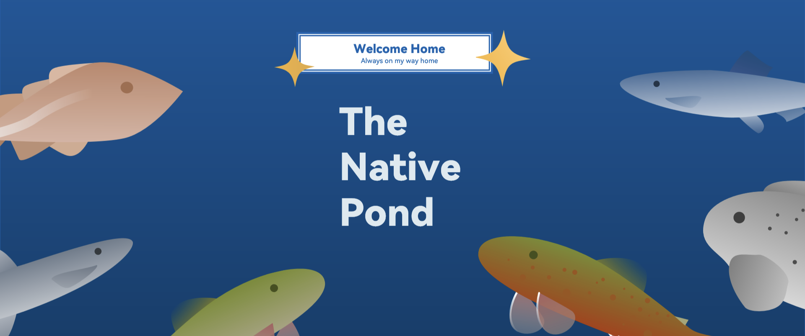

# The Native Pond

> **"Rekindle your love for gaming"**

    

English | [简体中文](https://github.com/BeyondPixelsStudio/TheNativePond/blob/main/README-zh_CN.md) | [繁體中文](https://github.com/BeyondPixelsStudio/TheNativePond/blob/main/README-zh_TW.md) | [文言](https://github.com/BeyondPixelsStudio/TheNativePond/blob/main/README-zh_HX.md)

**The Native Pond** is a cozy, non-profit indie game developed by **Beyond Pixels Studio**. 

Today, players are trapped in endless "daily logins", battle pass levels, stat-checking, and gacha anxiety. We want to create a gentle rebellion—**no daily check-ins, no stat grinding, no mandatory quests or dungeons**. This is a small pond with no stamina bars, no combat power ratings, and not even a forced objective. Here, **rekindle your love for gaming**.

---

## ✨ Core Experience & Gameplay

*The Native Pond* rejects the "click-and-get" fast-food game design. We have restored the genuine touch of life through a 1:1 realistic flow beneath a minimalist visual style.

### 🎣 1:1 Immersive & Realistic Fishing

This is not an arcade mini-game where you hit the spacebar to catch a fish. We are dedicated to recreating the authentic flow of fishing:

- **Hand-mixed Bait**: You need to buy basic bait from the in-game general store. Depending on the weather and target waters, add water, knead, wake the bait, and chum the water step by step.  
- **Realistic Waiting**: Hook the bait, cast the line, watch the subtle changes in the water's ripples and the downward movement of the bobber, and grasp the perfect moment to set the hook.  
- **Special Collectibles**: Sometimes, what you catch isn't a fish, but a special "collectible".  

### 🍳 Cozy & Free Cooking

Beyond fishing, the game features a cooking system with steps completely identical to reality, filling the cyberspace with a sense of real life:

- **Hardcore Step-by-Step Breakdown**: Want a bowl of plain noodles? You first need to buy flour, add water on the cutting board, knead the dough, let it rest, and roll out the noodles yourself.  
- **Heat & Timing**: Fill the pot with water, turn on the stove, and patiently wait for the water to boil before cooking. Every step is indispensable, allowing you to feel the grounding satisfaction of food taking shape in your hands.  
- **Absolute Culinary Freedom**: You can strictly follow "recipes", or ignore all rules and mix ingredients as you please. Whether it's a surprising delicacy or a kitchen disaster, there is only joy here, no punishment.  

### 🎨 Ultimate Minimalist Visual Aesthetics

- **Color Blocking & Flat Design**: Discarding redundant textures, we use pure SVG vector color blocks to partition the screen.  
- **De-UI Design**: No screens cluttered with buttons or top-up portals. The interface is clean and restrained, completely surrendering the screen to the water surface.  
- **Pure Relaxation**: Non-linear animations let the pond water gently "breathe". During the long wait, we return time to your brain.  

---

## 🛠️ Tech Stack & Architecture

To ensure a lightweight footprint, cross-platform compatibility, and easy community involvement, this project adopts the following technical foundation:

- **Core Engine**: Built on the **TurboWarp** platform and the **Icyphantom Framework**.  
- **Rendering Solution**: Native HTML5 rendering, extremely lightweight, running smoothly on various low-end devices.  
- **Asset Format**: A massive amount of art assets utilize Scalable Vector Graphics (SVG), ensuring edge sharpness at any resolution.  

---

## 📦 Download & Distribution Platforms

Fish whenever and wherever you want. You can experience *The Native Pond* through the following methods:

### 1. Source Code & Direct Download

No code compilation is required. Regular players can go directly to the [**Releases**](https://github.com/BeyondPixelsStudio/TheNativePond/releases) page of this repository to download the latest builds:

- 📱 **Android (.apk)**: Install on mobile devices, a digital sanctuary you carry with you.  
- 💻 **Windows (.exe)**: Launch the full-screen immersive time on your PC.  

### 2. Game Distribution Platforms

Once the project enters a stable phase, we will gradually launch on the following platforms:

> [!NOTE]
> Regardless of the platform, apart from integrating with each platform's achievement system, the game experience provided by all distribution platforms is identical.

- **International Distribution Platforms**  
	- Google Play  
	- Steam  
	- Epic Games Store  
	- Itch.io (TBD)  
	- QooApp (TBD)  
	- Game Jolt (TBD)  

- **Mainland China Exclusive Distribution Platforms**  
	- TapTap  
	- HaoYouKuaiBao
	- Bilibili (TBD)  
	- WeGame (TBD)  

> [!IMPORTANT]
> If you find *The Native Pond* on other game distribution platforms not mentioned in this list, please do not hesitate—that is not our official release. Please report the game immediately and let us know.

---

## 🤝 Contributing

*The Native Pond* is not just our work; we hope it becomes a "public rest area" for all exhausted gamers. Whether you understand code or not, you can contribute to this pond!

We highly welcome Issues in the following forms:  
1. **Memory Fragment Submission**: Write a touching sentence for the game or share an old memory that reflects a bygone era.  
2. **Hometown Recipe Contribution**: Design a brand-new recipe (e.g., how to make authentic hot dry noodles) and break down its realistic steps.  

> [!TIP]
> Before participating, please make sure to read our [Contributing Guidelines](https://github.com/BeyondPixelsStudio/TheNativePond/CONTRIBUTING.md) and follow the [Code of Conduct](https://github.com/BeyondPixelsStudio/TheNativePond/CODE_OF_CONDUCT.md).

> [!NOTE]
> Due to the single source file limitation of TurboWarp, please do not submit Pull Requests directly to the source file. However, you can submit bugs to our [Issues](https://github.com/BeyondPixelsStudio/TheNativePond/issues) page.

---

## 🌐 Internationalization

We want **The Native Pond** to be experienced by players all over the world. If you want to help translate the game into your language:

1. Fork this repository.  
2. Find the language files (in the `/lang/` directory).  
3. Add or update the translation.  
4. Submit a [Pull Request](https://github.com/BeyondPixelsStudio/TheNativePond/pulls).  

---

## 🎞️ Media Platforms & Gaming Communities

Our promotional videos, announcements, and game updates will be published on the following platforms:

> [!NOTE]
> Platforms are sorted by update priority. Content provided on certain streaming platforms or gaming communities may be adjusted based on operational conditions.

- **International Media Platforms**  
	- YouTube  
	- TikTok  
	- Instagram  
	- Twitch  

- **International Gaming Communities**  
	- Discord  
	- Reddit  

- **Chinese Mainland Media Platforms**  
	- Bilibili  
	- WeChat Video Channel
	- Douyin  
	- Kuaishou  

- **Chinese Mainland Gaming Communities**  
	- Xiaohongshu  
	- Baidu Tieba  
	- Zhihu  
	- Weibo  
	- Xiaoheihe
	- KOOK  

> [!IMPORTANT]
> If you find accounts claiming to be *The Native Pond* on media platforms or gaming communities not mentioned in this list, please do not hesitate—they are not our official accounts. Please report them immediately and let us know.

---
## 🛡️ Open Source License

- **License**: This project is open-sourced under the **CC BY-NC-SA 4.0** license. We encourage the free use, modification, and sharing of this game, but **strictly prohibit any form of commercial profit and repackaged reselling**. See the [LICENSE](https://github.com/BeyondPixelsStudio/TheNativePond/LICENSE) file for details.  
- **About Open Source**: Strictly speaking, *The Native Pond* is not an open-source game. According to the definition by the **OSI (Open Source Initiative)**, a true "open-source software" must meet 10 criteria. The core rule is: **No Discrimination Against Fields of Endeavor**. Therefore, in the rigorous context of GitHub or developer communities, projects using CC BY-NC-SA 4.0 are referred to as **"Source-Available"** or **"Non-Commercial Shared"**, rather than standard open source.  

---
## 💌 About Us & Credits

### **Development Team**: **Beyond Pixels Studio**

- Official Game Email: thenativepond@gmail.com  
- Official Studio Email: studio.beyondpixels@gmail.com  

### Developers
#### [Crazy Sue](https://github.com/CrazySue)
- **Roles & Responsibilities**  
	- Game Development  
	- UI Design  
	- Global Operations  
- **Contact**  
	- Email: bugs.crazysue@gmail.com  
	- YouTube: [@bugs.crazysue](https://www.youtube.com/@bugs.crazysue)  
	- Discord: [@bugs.crazysue](https://discord.gg/svC4nfyMTq)  
	- X: [@BugsCrazySue](https://x.com/bugs.crazysue)  
	- BiliBili: [@疯狂的Sue](https://b23.tv/WGMihQZ)  
	- Zhihu: [@疯狂的Sue](https://www.zhihu.com/people/bugs.crazysue)  
	- Xiaohongshu: [@疯狂的Sue](https://www.xiaohongshu.com/user/profile/63699a3c000000001f01ce42?xsec_token=YBKFAlAzKJzfliJUOzGJNvhuNOR5LKIiVtfTNRFdVWgAY%3D&xsec_source=app_share&xhsshare=&shareRedId=ODk4OTxGN0w2NzUyOTgwNjdJOThHSjo7&apptime=1773544200&share_id=aa3bf22d6c8344f1976abe9ec3af5c37&share_channel=copy_link)  
	- Douyin/Kuaishou: @疯狂的Sue  

#### [Zong Zi](https://github.com/zongzibaby)
- **Roles & Responsibilities**  
	- Art Textures  
	- Copywriting  
	- QA Testing  
	- Mainland China Operations  
- **Contact**  
	- Email: abczongzi@gmail.com  
	- BiliBili: [@粽子不吃杨梅](https://b23.tv/aBZxZLz)  
	- Zhihu: [@粽子不吃杨梅吖](https://www.zhihu.com/people/zhiimvyd)  
	- Xiaohongshu: [@粽子不吃杨梅吖](https://xhslink.com/m/906c289db25)  
	- Douyin/Kuaishou: @粽子不吃杨梅吖  

#### [Fresh](https://github/Fresh404a)
- **Roles & Responsibilities**  
	- Sound Effects & Background Music  
	- QA Testing  
	- Mainland China Operations  
- **Contact**  
	- Email: fresh361968@gmail.com  
	- YouTube: [@fresh]()  
	- Discord: [@fresh404a]()  
	- BiliBili: [@Fresh_404]()  
	- Zhihu: [@Fresh]()  
	- Xiaohongshu: [@Fresh_]()  
	- Douyin/Kuaishou: @Fresh_  

### Credits
#### **Special Thanks**
- [@awa_liny](https://www.awaliny.top)  
	- The game *Today's Polar Bay* developed by awa_liny is the source of inspiration and art asset library for *The Native Pond*.  
	- *Today's Polar Bay* laid the foundation for the art style and UI design of *The Native Pond*.  

- [@Minecraft](https://minecraft.net)  
	- *Minecraft* is the beacon for the development team of *The Native Pond*, and it serves as our role model.  
	- *Minecraft* guided the freedom-first development philosophy of *The Native Pond*.  

- [@Farmer's Delight](https://www.curseforge.com/minecraft/mc-mods/farmers-delight)  
	- *Farmer's Delight* provided guidance for the healing and slow-paced concepts of *The Native Pond*.  
	- Many mechanics, such as the step-by-step culinary preparation in *Farmer's Delight*, inspired related features in *The Native Pond*.  

---

*"Dedicated to you who need a rest, along with a fishing rod and a bowl of hot noodles."*
