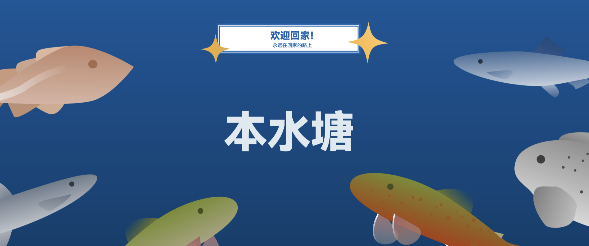

# 本水塘

> **“重拾对游戏的热爱”**

   

简体中文 | [English]() | [繁体中文]() | [文言]() | [Русский]() | [Español]() | [Português]() | [Deutsch]() | [한국인]() | 
[Français]() | [日本語]() | [Türkçe]()

**本水塘** 是由 **Bualo Studio（浮标工作室）** 开发的一款非营利性治愈系游戏。 

当下，玩家们正被困在无尽的日常打卡、通行证等级、数值碾压和抽卡焦虑中。我们希望让玩家回归到对游戏最初的热爱，而不是将游戏视为一种需要按时签到打卡的负担。所以，我们的游戏——**无签到打卡、无数值强度、无任务副本**。这是一个没有体力条、没有战斗力评分、甚至没有强制目标的小池塘。在这里，**重拾对游戏的热爱**。

---

## ✨ 核心体验与玩法

《本水塘》拒绝“点击即得”的快餐化设计。我们将生活中的真实触感，通过拟真的流程还原到了极简的画面之下。

### 🎣 沉浸式拟真垂钓

这绝非一个按空格键就能把鱼拉上来的街机小游戏，我们致力于还原真实的垂钓心流：

- **亲手开饵**：你需要在游戏内的杂货铺购买基础饵料，根据天气和目标水域，一步步按比例加水、揉搓、醒饵、打窝。  
- **拟真等待**：挂饵、抛竿，观察水面涟漪的细微变化与浮标的下沉动作，把握提竿的最佳时机。  
- **特殊藏品**：有时钓上来的并非鱼，而是“藏品”。  

### 🍳 充满烟火气的自由烹饪

垂钓之外，游戏内置了与现实步骤完全一致的烹饪系统，让赛博空间充满生活的实感：

- **硬核的步骤拆解**：想吃一碗阳春面？你需要先买面粉，在案板上亲手加水、和面、醒发、擀面条。  
- **火候与时间**：接水、开火，耐心等待水沸腾后再下锅煮。每一个步骤都不可省略，感受食物在手中逐渐成型的踏实感。  
- **绝对自由的烹饪**：你可以严格遵循“菜谱”，也可以无视一切规则随心搭配食材。无论是惊喜的美味还是黑暗料理，这里只有乐趣，没有惩罚。  

### 🥬 休闲放松的种田时光

游戏还提供种田的玩法，让每个玩家都能亲手开辟出一片小天地。
- **播种**：到了适宜农作物生长的季节，你便可开垦出一片田地，播下种子、浇水、施肥，为作物生长提供滋养。
- **生长**：当环境适宜时，作物便会茁壮生长。无需过多打理，只需偶尔关注，让种田生活变得轻松而有乐趣。
- **收获**：作物成熟时，你可以收获作物。并非简单点一点的快速收集，而是模拟真实的采摘/收割流程，让你切实体会到收获的喜悦与成就感。

### 🎨 极致的极简视觉美学

- **大色块与扁平化**：摒弃多余的纹理，使用纯粹的 SVG 矢量色块分割画面。  
- **去 UI 化设计**：没有满屏的按钮和充值入口，画面干净克制，将屏幕彻底交给水面。  
- **纯粹的放空**：非线性动画让池水微微“呼吸”，在漫长的等待中，把时间还给你的大脑。  

> [!TIP]
> 对《本水塘》的游戏玩法有浓厚的兴趣？请阅读我们的 [《大饼清单》](https://github.com/BualoStudio/TheNativePond/blob/main/docs/game/FlatbreadList-zh_CN.md)！

---

## 📦 获取游戏与分发平台

随时随地，想钓就钓。你可以通过以下方式体验《本水塘》：

### 1. 💾 源码与直接下载

无需编译代码，普通玩家可直接前往本仓库的 [**Releases**](https://github.com/BeyondPixelsStudio/TheNativePond/releases) 页面下载最新构建版本：

- 📱 **Android**  
- 📱 **iOS**  
- 📱 **ipadOS**
- 💻 **Windows**  
- 💻 **macOS**  
- 💻 **Linux**  
- 💻 **ChromeOS**  
- 📱 **HarmonyOS**  

### 2. 🕹️ 游戏分发平台

项目进入稳定期后，我们将逐步登陆以下平台：

> [!NOTE]
> 无论是哪一平台，除接入各平台的成就系统外，所有分发平台提供的游戏体验均是一致的。

- Google Play  
- Steam  
- Epic Games Store  
- TapTap  
- Bilibili  
- WeGame  

> [!IMPORTANT]
> 如果你在该名单中未提到的其他游戏分发平台中发现了《本水塘》，请不要犹豫，那不是我们发布的官方游戏，请立即举报该游戏并 [告诉](https://github.com/BualoStudio/TheNativePond#%E5%BC%80%E5%8F%91%E5%9B%A2%E9%98%9Fbualo-studio%E6%B5%AE%E6%A0%87%E5%B7%A5%E4%BD%9C%E5%AE%A4) 我们。

---

## 🛠️ 技术栈与架构

为了确保轻量化、跨平台以及便于社区的介入，本项目采用了以下技术基础：

- **底层引擎**：基于我们专为《本水塘》打造的 [**小冰岛**](https://github.com/BualoStudio/Icelet) 游戏引擎开发。  
- **渲染方案**：HTML5 原生渲染，极致轻量，流畅运行于各类低端设备。  
- **资产格式**：大量美术资产均采用SVG格式，确保在任何分辨率下的边缘锐度。  

---

## 🤝 参与共建

《本水塘》不仅仅是我们的作品，我们希望它能成为所有疲惫玩家的“精神加油站”。无论你是否了解游戏开发或代码，都可以为这个小池塘添砖加瓦！

我们极其欢迎以下形式的 Issue：

1. **记忆碎片投递**：为游戏撰写一句动人的文案，或分享一段具有时代感的回忆性短文。  
2. **家乡食谱贡献**：设计一份全新的食谱（例如：如何做一碗正宗的热干面），并拆解它的制作步骤。  

> [!TIP]
> 参与前，请务必阅读我们的 [贡献指南](https://github.com/BualoStudio/TheNativePond/CONTRIBUTING.md) 并遵守 [行为准则](https://github.com/BualoStudio/TheNativePond/CODE_OF_CONDUCT.md)。

> [!NOTE]
> 由于 TurboWarp 的单一源文件限制，请不要直接对源文件提交 Pull Request。但你可以将 Bug 提交到 [Issue](https://github.com/BualoStudio/TheNativePond/Issue)。

---

## 🌐 本地化

我们希望《本水塘》能被全世界的玩家体验。如果你想帮助将游戏翻译成你的语言：

1. Fork 本仓库。  
2. 找到语言文件（在 `/lang/` 目录下）。  
3. 添加或更新翻译。  
4. 提交 [Pull Request](https://github.com/BualoStudio/TheNativePond/pulls)。  

> [!NOTE]
> 目前由官方支持的语言：

| 语言   | 游戏内语言支持 | 运营文档/公告内语言支持 | 开发文档/公告内语言支持 |
| ---- | ------- | ------------ | ------------ |
| 简体中文 | ✅       | ✅            | ✅            |
| 英语   | ✅       | ✅            | ✅            |
| 繁体中文 | ✅       | ✅            | ❌            |
| 文言   | ✅       | ⚠️           | ❌            |
| 俄语   | ⚠️      | ⚠️           | ❌            |
| 西班牙语 | ⚠️      | ⚠️           | ❌            |
| 葡萄牙语 | ⚠️      | ⚠️           | ❌            |
| 德语   | ⚠️      | ⚠️           | ❌            |
| 韩语   | ⚠️      | ⚠️           | ❌            |
| 法语   | ⚠️      | ⚠️           | ❌            |
| 日语   | ⚠️      | ⚠️           | ❌            |
| 土耳其语 | ⚠️      | ⚠️           | ❌            |

- ✅：完全支持的语言，保证翻译质量。
- ⚠️：基本支持的语言，可能由AI或机器翻译得到，不保证语境、语法准确无误。
- ❌：不受支持的语言，在该条目内不会看到这个语言的翻译。

> [!TIP]
> 本水塘的本地化工作是由众多像你一样的志愿者提供的，请查看我们的 [本地化致谢名单]() 。

> [!TIP]
> 由于我们的开发周期和精力/资源分配等多方面问题，我们无法保证翻译100%准确。由于我们没有专门的本地化团队，所以部分语言可能是由AI或机器翻译得到的，其翻译未必准确无误，如果您在游玩过程中发现了翻译问题，请按上述方法 [提交PR](https://github.com/BualoStudio/TheNativePond/pulls) 或 [提交Issue](https://github.com/BualoStudio/TheNativePond/Issue) 。

---

## 🎞️ 运营平台

我们的宣传片、公告以及游戏动态将会在以下平台发布：

> [!NOTE]
> 部分平台提供的内容可能会根据运营情况进行调整。

| 名称         | 视频  | 回复  | 公告  | 直播  | 整活  |
| ---------- | --- | --- | --- | --- | --- |
| Youtube    | ✅   | ✅   | ✅   | ✅   | ✅   |
| Tiktok     | ✅   | ✅   | ✅   | ✅   | ✅   |
| X(Twitter) | ✅   | ✅   | ✅   | ❌   | ✅   |
| Twitch     | ❌   | ❌   | ❌   | ✅   | ❌   |
| Instagram  | ✅   | ❌   | ✅   | ❌   | ❌   |
| Facebook   | ✅   | ❌   | ✅   | ❌   | ❌   |
| WhatsAPP   | ❌   | ✅   | ❌   | ❌   | ❌   |
| 哔哩哔哩       | ✅   | ✅   | ✅   | ✅   | ✅   |
| 微信公众号      | ❌   | ✅   | ✅   | ❌   | ❌   |
| 微信视频号      | ✅   | ✅   | ❌   | ✅   | ❌   |
| 抖音         | ✅   | ✅   | ❌   | ✅   | ✅   |
| 快手         | ✅   | ❌   | ❌   | ❌   | ✅   |
| Discord    | ❌   | ✅   | ✅   | ❌   | ❌   |
| Reddit     | ❌   | ✅   | ✅   | ❌   | ❌   |
| 小红书        | ✅   | ✅   | ✅   | ❌   | ✅   |
| 百度贴吧       | ❌   | ❌   | ✅   | ❌   | ❌   |
| 知乎         | ❌   | ❌   | ✅   | ❌   | ❌   |
| 微博         | ❌   | ❌   | ✅   | ❌   | ❌   |
| 小黑盒        | ❌   | ❌   | ✅   | ❌   | ❌   |
| KOOK       | ❌   | ❌   | ✅   | ❌   | ❌   |

> [!IMPORTANT]
> 如果你在该名单中未提到的其他流媒体平台或游戏社区平台中发现了《本水塘》的账号，请不要犹豫，那不是我们的官方账号，请立即举报该账号并 [告诉](https://github.com/BualoStudio/TheNativePond#%E5%BC%80%E5%8F%91%E5%9B%A2%E9%98%9Fbualo-studio%E6%B5%AE%E6%A0%87%E5%B7%A5%E4%BD%9C%E5%AE%A4) 我们。

> [!TIP]
> 由于我们的精力/资源分配等多方面问题，我们无法保证所有平台同步更新内容，部分平台可能会有几分钟的延迟。由于我们没有专门的运营团队，所以并不是所有平台和功能都受支持。

---

## 📜 许可证

我们鼓励自由使用、修改与分享本游戏。对于许可证，我们将不同类别的游戏资产按不同许可证开源/开放源代码，详见 [LICENSE](https://github.com/BualoStudio/TheNativePond/blob/main/LICENSE) 文件。对于不同资产类型所使用的不同的许可证划分如下：

### 1. ⌨️ 代码资产

对于《本水塘》中的所有**代码资产**（包括但不限于游戏源代码、自定义扩展源代码），我们一律使用 [**MIT License**](https://github.com/BualoStudio/TheNativePond/blob/main/docs/about/license/code-license) 将所有代码资产面向全人类**开源**。 

### 2. 🖌️ 美术资产

对于《本水塘》中使用的**美术资产**（包括但不限于游戏贴图、游戏地图、角色立绘），共有两种情况：

1. 部分美术资产来源于由 awa_Liny 开发的《今日极地湾》，这部分美术资产的版权由 Bualo Studio 和 awa_Liny 共同持有。这部分美术资产使用 [**CC BY-NC 4.0 License**](https://github.com/BualoStudio/TheNativePond/blob/main/docs/about/license/art&music-license) **开放源代码**。
2. 剩余的美术资产由 Bualo Studio 设计，这部分美术资产的版权由 Bualo Studio 持有，这部分美术资产使用  [**CC BY-NC 4.0 License**](https://github.com/BualoStudio/TheNativePond/blob/main/docs/about/license/art&music-license) **开放源代码**。

### 3. 🪗 音乐资产

对于《本水塘》中使用的**音乐资产**（包括但不限于背景音乐、环境音乐），我们一律使用 [**CC BY-NC 4.0 License**](https://github.com/BualoStudio/TheNativePond/blob/main/docs/about/license/art&music-license) **开放源代码**。

> [!NOTE]
> 我们之所以让美术资产和音乐资产使用非商业性许可证，是为了避免劣质（这里指几乎没有改动或改动范围过小）的二次修改版本，如果这些劣质的二次修改版本被卖出了高价将会对《本水塘》的名誉造成严重影响。为避免此问题，我们让这些资产使用非商业性许可证。  
> 但是，如果你真心的希望为《本水塘》制作优质的二次修改版本，只要我们能够看出你在这件事上投入了精力和心灵，我们完全不介意你售卖这样的优质二次修改版本，即使你有所收益。  
> 如果你实在不放心售卖二次修改版本，请 [联系我们](https://github.com/BualoStudio/TheNativePond#-%E5%BC%80%E5%8F%91%E5%9B%A2%E9%98%9Fbualo-studio%E6%B5%AE%E6%A0%87%E5%B7%A5%E4%BD%9C%E5%AE%A4) 以获取官方授权！  

---

## 📌 关于

### 🪪 **开发团队**：**Bualo Studio（浮标工作室）** 

- 制作组官方邮箱： thenativepond@gmail.com  
- 工作室官方邮箱： bualostudio@gmail.com  

### 🖥️ 制作组
#### [Crazy Sue](https://github.com/CrazySue)
- 总策划  
- 编程开发  
- UI/UX设计  
- 辅助文案  
- 总运营/国际区运营  
- 测试  
#### [Zong Zi](https://github.com/zongzibaby)
- 剧情策划
- 总文案  
- 辅助美术  
- 中国区运营  
- 测试  
#### [Fresh](https://github/Fresh404a)
- 联合策划  
- 责任音乐  
- 测试  
#### [Jiang Yue](https://github/jiangyue-77)
- 总美术  
- 联合文案  
- 测试  
#### [Grass Sheep](https://github/Grass-Sheep)
- 总测试  
- 中国区运营  

### 🐱 猫咪
#### [awa_Liny](https://github.com/awaLiny2333)
- awa_liny 开发的游戏《今日极地湾》是《本水塘》的灵感源泉和美术素材库。  
- awa_liny 开发的游戏《今日极地湾》为《本水塘》的美术风格和UI/UX设计奠定了基础。  

### 🤝 外部援助组
#### [Zhou Wei]()
- 策划指导
- 文案指导
#### [Kiyana]()
- 音乐指导

### 💌 鸣谢

#### 值此感谢

> [!TIP]
> “值此感谢”中列出的玩家贡献相等，排名随机。

- 以下玩家在《本水塘：第一次玩家意见征集》意见征集活动中提出了很多宝贵意见，在此感谢：  
	RAY-冯 雨过天晴 N 传承 yuouo 胜似L.R. 沐yu NaClhhhh 郑 SHANG 马 川 禹 秦甲乙丙丁 王韦 墨盛君 这个月半子不太冷静 LuV·C Feliex·26824 LZD 季谕 又是那颗昕 张双燕 凉城孤岛 少冰茉莉拿铁 Lovegood ？

#### 特别感谢

- [@Minecraft](https://minecraft.net)  
	- Minecraft 是《本水塘》制作组的灯塔，它是我们的学习榜样。  
	- Minecraft 为《本水塘》自由至上的开发理念提供了指引。  
- [@Farmer's Delight](https://www.curseforge.com/minecraft/mc-mods/farmers-delight)  
	- Farmer's Delight 为《本水塘》治愈系、慢节奏等理念提供了引导。  
	- Farmer's Delight 中的逐步制作美食等许多设定均为《本水塘》的相关设定带来了灵感。  

---

*“献给需要休息的你，以及一支鱼竿、一碗热面。”*
